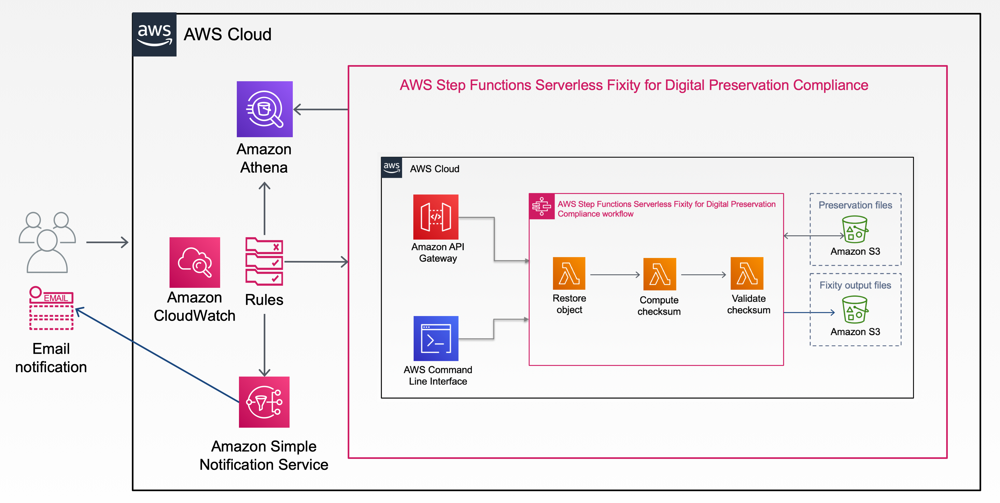
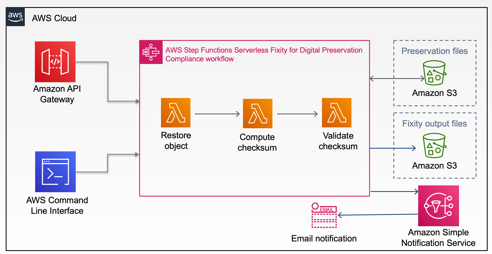

# FixityService




# Overview
* On ingest, system upload file to S3 bucket for preservation, verify the object's integrity during the upload. See [Check the integrity of an object uploaded to Amazon S3](https://aws.amazon.com/premiumsupport/knowledge-center/data-integrity-s3/).
    * Fixity Service performs the initial fixity check on each uploaded file.
* Everyday Fixity service checks file's last fixity check date on or before 90 days and performs fixity check on these files
* Fixity service sends a daily email with a summary report only when there is a "MISMATCHED" event occurred. (e.g. Today, fixity check, there are # mismatched, the location of files, filename, etc).

# Deploy Fixity Service application using CloudFormation stack
#### Step 1: Launch CloudFormation stack
[](https://console.aws.amazon.com/cloudformation/home?region=us-east-1#/stacks/new?&templateURL=https://steps-fixity-us-east-1.s3.amazonaws.com/steps-fixity-solution/version1/serverless-fixity-for-digital-preservation-compliance.template)

Click *Next* to continue

#### Step 2: Specify stack details

| Name | Description |
|:---  |:------------|
| Stack name | any valid name |
| Access-Control-Allow-Origin | If you plan to use the api for web development, specify the origin here. Default uses wildard (*) |
| Anonymous Usage | Select 'Yes' to opt-in to help us to improve the solution. The solution collects and sends the following data **anonymously**: Algorithm used for the fixity process, FileSize of the object, Elapsed time of the fixity process, and the ComparedResult status (matched, notmatched, or skipped) |

#### Step 3: Configure stack options
Leave it as is and click **Next**

#### Step 4: Review
Make sure all checkboxes under Capabilities section are **CHECKED**

Click *Create stack*

# Usage
* Example task json file
```
{"Bucket": "preservation-bucket", "Key": "filename.tif", "OutputBucket": "fixity-output-bucket"}
```
* Execuate Lambda function
```
aws stepfunctions start-execution --state-machine-arn arn:aws:states:us-east-1:youraccountnumber:stateMachine:SO0081-StackName-serverless-fixity --input file://taskfile.json
```

# Special thanks to
* [Serverless Fixity for Digital Preservation Compliance](https://aws.amazon.com/solutions/implementations/serverless-fixity-for-digital-preservation-compliance/)
